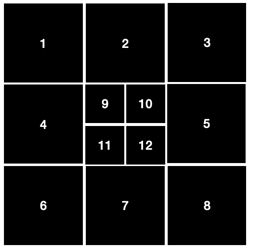

# winter_project_ZK
 This project aims to test richness of visual experience in foveal and peripheral areas. In the experiment, test images are presented followed by a sequence of patches located in random positions. The patches were either from the original images or nishimoto images. There are 12 locations:
 
 Due to the loading limitation of online experiment, a trick was used to present patches of original  images: we laid grey masks with transparent patch in the specific location over the original images.
 ### how to run experiment
 1. run BaseScriptCreate.m to create lists of original and nishimoto images and patches for subjects
 2. BaseScriptCreate.m also creates a folder called "WebVersion" which contains all the images and patches needed for the experiment
 3. run includeOrderCreate.m to create "include" iqx files named Script_Bk_Gk
 4. run CopyFiles to copy all the files to be used in the experiment to the same folder where test images in step 1 are located. This is because inquisit requires all the files (images, texts and scripts) used in the experiment to be in the same folder
 5. run Script_Bk_Gk to conduct the experiment
 ### changes compared with van's experiment
 1. We screened out nishimoto images without duplicate (see folder shinji_without_duplicate) using identification from Zhao. For this experiment, a total of 318 nishimoto images were selected for use (see square_images/Nullselected). The original nishimoto images were cut using shinji.m
 2. Test images and patches were cut as in the picture above using crop_image.m and 12 masks were created using Draw_Mask.m
 3. In base scripts, whether images in practice trials are congruent or incongruent are reported.
 4. catch trials are added in the experiment (see MainStructure_V2 and PictureAndText_V2)
 ### issues to be resolved
 1. When the experiment was run on the labtop, the response area was not located in the right place
 2. Randomization of patches (4 present probes (2 from original and 2 from nishimoto) and 4 (2 from original and 2 from nishimoto)) doesn't work

